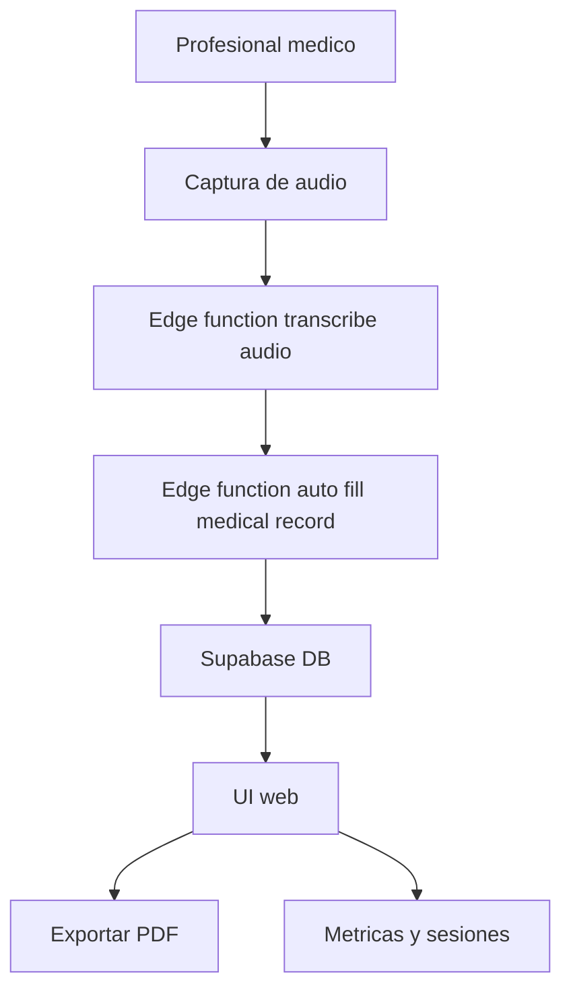

# Medivoz Smart Scribe

Sistema de transcripción médica asistida por IA para generar historiales clínicos electrónicos a partir de consultas médicas en tiempo real.

## Descripción

Aplicación web full‑stack que combina captura de audio, transcripción asistida por IA y generación de fichas clínicas estructuradas para reducir el tiempo dedicado a documentación médica.

## Cómo funciona (mermaid)



## Características

- **Grabación en tiempo real**: Captura de audio del encuentro médico desde el navegador.
- **Transcripción asistida por IA**: Conversión de audio a texto usando modelos de NLP.
- **Auto‑relleno de historial clínico**: Generación de fichas médicas estructuradas a partir de la transcripción.
- **Gestión de pacientes**: CRUD de expedientes clínicos.
- **Sesiones y métricas**: Vista de sesiones y actividad.
- **Exportación a PDF**: Descarga de documentos médicos en PDF.

## Stack

- **Frontend**: React 18 + TypeScript, Vite, Tailwind CSS, shadcn/ui, React Router, Zod.
- **Estado de datos**: TanStack Query.
- **Backend / BaaS**: Supabase (PostgreSQL, Auth, Edge Functions).
- **IA / Audio**: OpenAI GPT‑4o‑mini, Web Audio API, MediaRecorder API.

## Requisitos

- **Node.js** 18+ o **Bun** 1.0+.
- Gestor de paquetes (npm, yarn, pnpm o bun).
- Proyecto en **Supabase** con acceso a Edge Functions.
- Clave de **OpenAI API** válida.

## Instalación rápida

```bash
git clone <repository-url>
cd medivoz-smart-scribe
npm install        # o bun install
```

### Variables de entorno

Crea `.env` en la raíz basado en `.env.example`:

```env
VITE_SUPABASE_URL=https://tu-proyecto.supabase.co
VITE_SUPABASE_ANON_KEY=tu-clave-anon-key-aqui

# Opcional para desarrollo local:
# VITE_API_URL=http://localhost:8080
```

El archivo `.env` está ignorado en git; no subas credenciales al repositorio.

### Supabase (mínimo necesario)

```bash
npm install -g supabase   # si no lo tienes
supabase link --project-ref tu-project-ref
supabase db push          # aplicar migraciones

# Edge Functions clave
supabase functions deploy transcribe-audio
supabase functions deploy auto-fill-medical-record
```

En Supabase > Edge Functions > Settings configura:

```env
OPENAI_API_KEY=sk-...tu-clave-api-openai
OPENAI_MODEL=gpt-4o-mini
```

## Desarrollo

```bash
npm run dev      # servidor de desarrollo en http://localhost:8080
```

## Build y preview

```bash
npm run build        # build producción
npm run build:dev    # build con source maps
npm run preview      # servir el build localmente
```

## Scripts útiles

```bash
npm run dev       # desarrollo
npm run build     # build producción
npm run build:dev # build debug
npm run lint      # ESLint
npm run preview   # preview de dist/

# Base de datos (Supabase CLI)
supabase db reset
supabase db push
```

## Deployment (resumen)

- **Vercel** o **Netlify**:
  - Comando de build: `npm run build`
  - Directorio de salida: `dist`
  - Configura `VITE_SUPABASE_URL` y `VITE_SUPABASE_ANON_KEY` como variables de entorno.

## Licencia y contribución

- Licencia: ver archivo `LICENSE`.
- Contribuciones bienvenidas vía Pull Requests con cambios pequeños y descriptivos.

